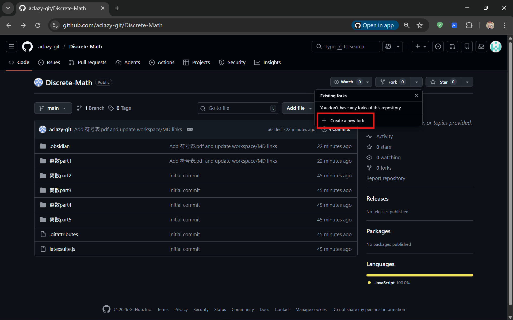
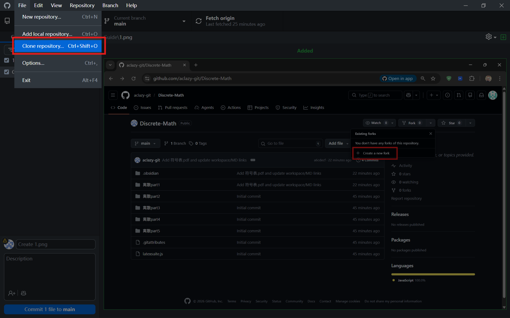
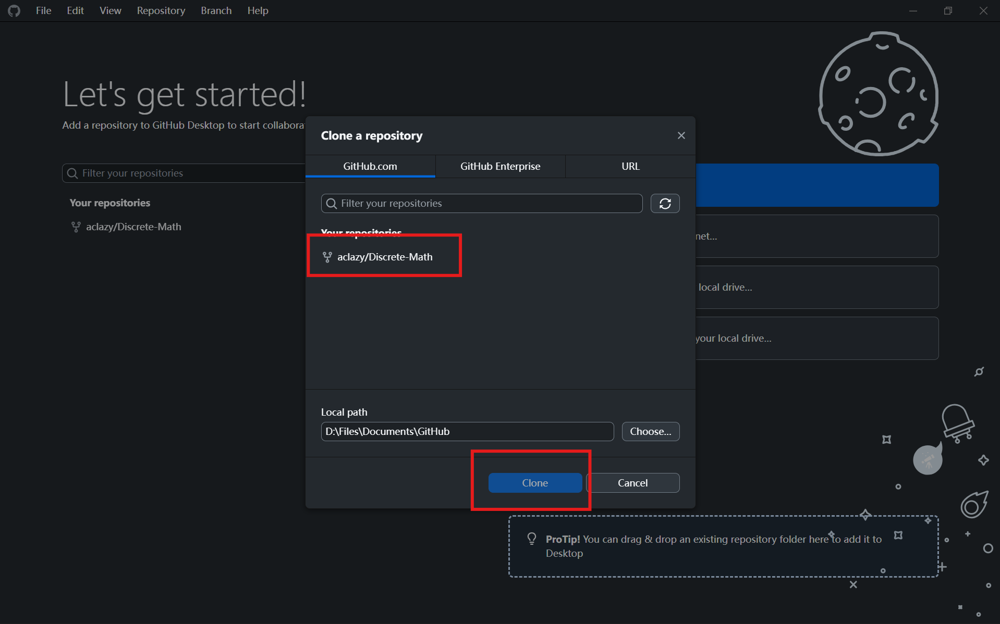
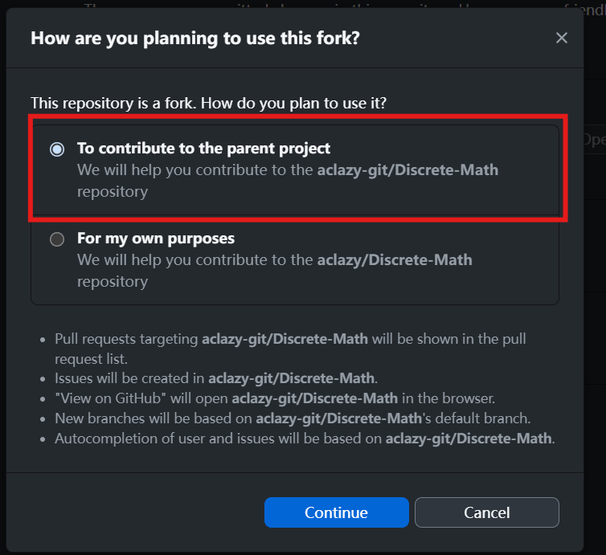
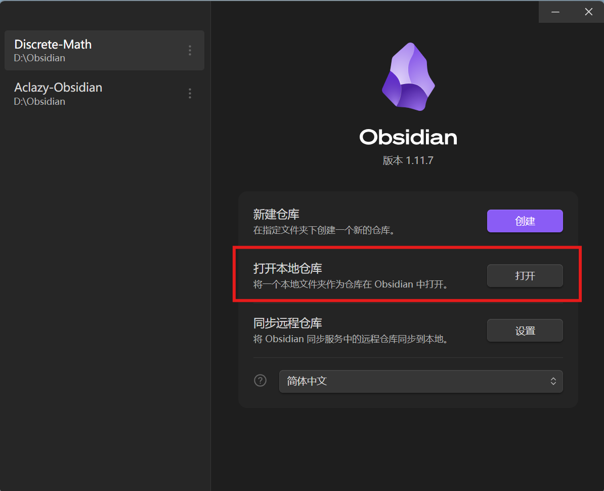
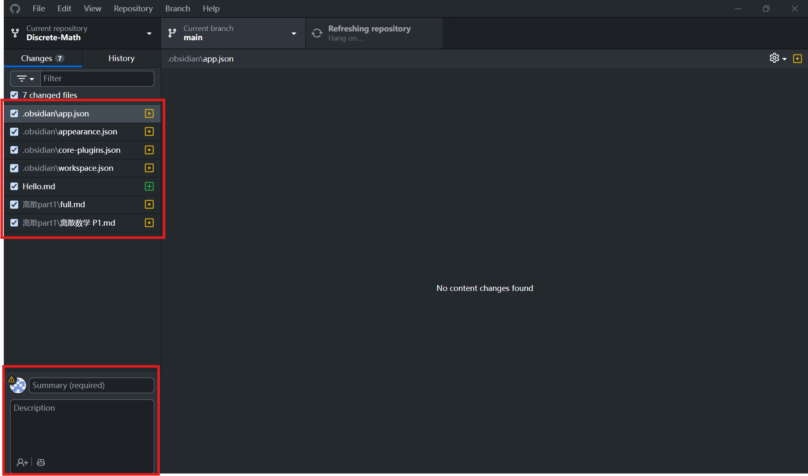
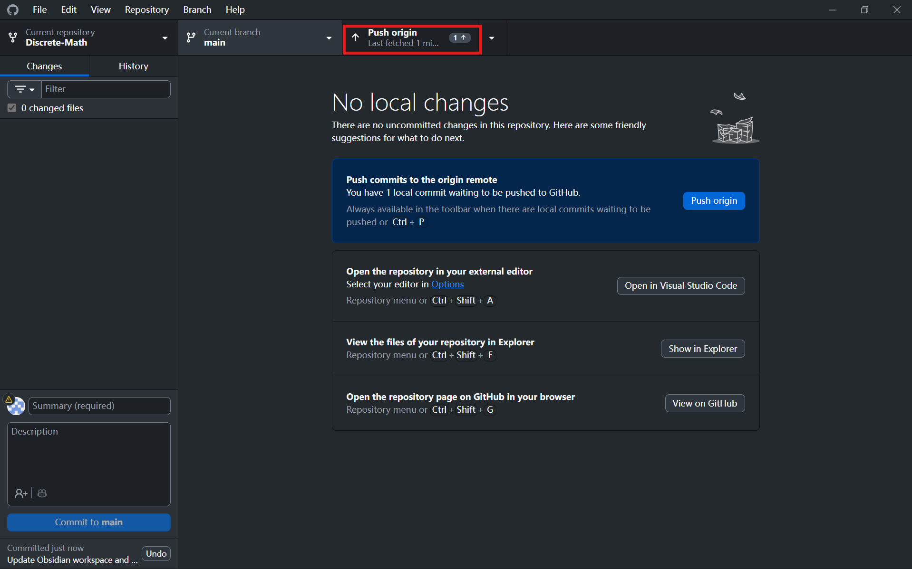
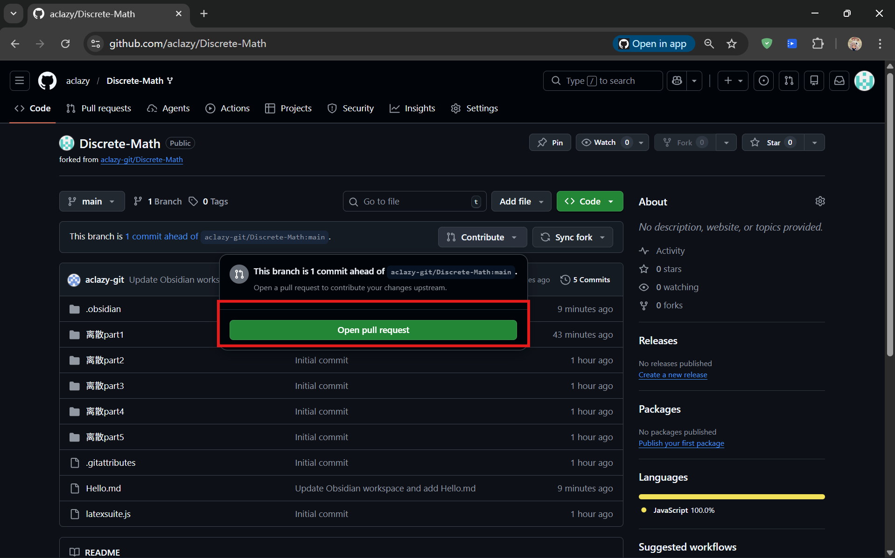
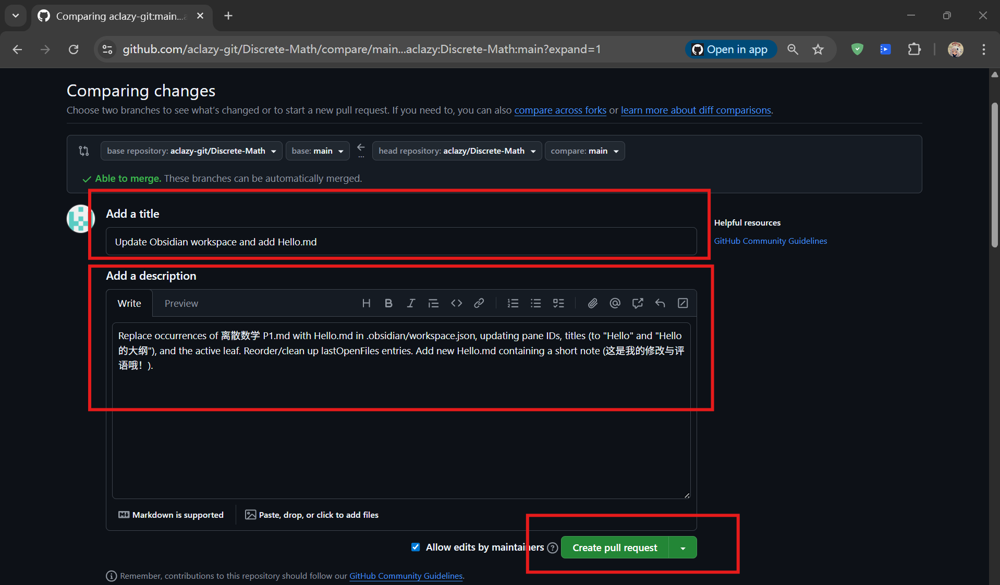

# 介绍

这是一个 **费曼学习法** **协作学习** 的实践项目。
实践对象是《离散数学》by Kennth。

# 步骤

## 准备

1. 安装 Obsidian 网址：https://obsidian.md/
2. 注册Github 账号，安装 Github Desktop 网址：https://github.com/apps/desktop

## Fork该仓库

在该网页中找到 Fork 按钮，点击 Create a new fork 后派生该仓库。

## Clone该仓库

在 Githubdesktop 左上角点击 File -> Clone repository 。

找到你刚刚 Fork 的仓库，并选择一个你喜欢的本地路径存储该仓库。

注意，一定要选择 Contribute to the parent project。

## Obsidian该仓库

在Obsidian中添加新仓库，找到你刚刚保存在本地的仓库

恭喜你，完成这一步后，可以直接在Obsidian中修改文件，添加评论，添加链接引用等操作。

## 提交你的修改

完成修改后打开 Github Desktop ，你会发现主页面显示了你刚刚作出的修改。

第一步，**在本地**保存你的修改。在左下角填写好这次修改的 Summary 和 Description ( 选填 )，后点击 Commite Changes 对本地文件进行保存。

第二部，点击右上角的 Push Origin ，将本地的修改同步到云端。

完成云端的同步后，进入 github.com 网页端。

点击新出现的 Contribute 按钮，将你作的修改供我检查，并且查看我的反馈。

通过填写 Title 和 Description 简要地告诉我你作出了什么修改。

一般来说，我在检查完修改后会进行 Commit 操作，将你的修改与我的源文件进行合并。

## ！！更新源文件！！

每次在进行编辑之前一定要检查是否与源仓库同步！

### 步骤 1：在 GitHub 网页上更新云端仓库

打开你的 GitHub 仓库网页。

在文件列表上方，你会看到一个灰色的条，写着：This branch is 1 commit behind [你的名字]:main（此分支落后于原作者 1 个提交）。

旁边有一个显眼的 Sync fork 按钮。

点击它，选择 Update branch。

此时，你的 GitHub Fork 仓库已经跟原仓库保持同步。

### 步骤 2：把更新拉回的电脑

打开 GitHub Desktop。

点击 Fetch origin。

按钮会变成 Pull origin，点击它。

此时，你的本地 Obsidian 里的文件才会真正更新。

